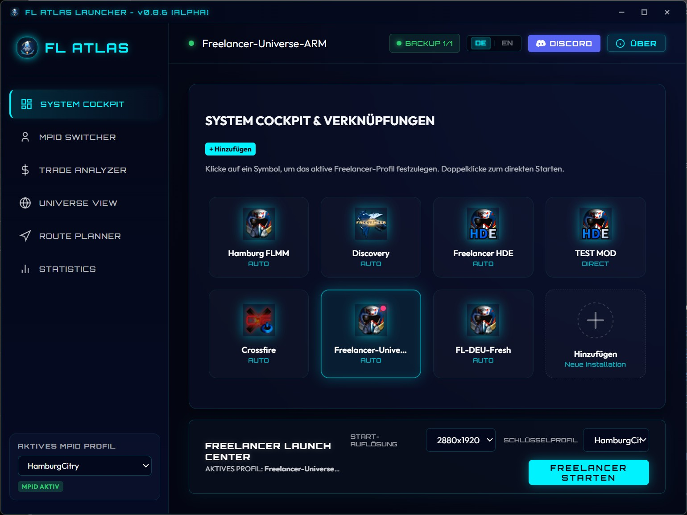

# FL Atlas Launcher V2

[Read in English](README.md) | [Читать по-русски](README.ru.md)

FL Atlas Launcher V2 ist ein moderner Launcher für Freelancer-Spieler, die mehrere Installationen, Multiplayer-Identitäten, Mods und Universumsdaten an einem Ort verwalten wollen.

Der Launcher setzt auf ein schnelles Sci-Fi-Cockpit-Gefühl, sicheres MPID-Handling, direkten Spielstart und praktische Karten- und Handelswerkzeuge für den Alltag.

## Download

Das aktuelle Windows-Paket gibt es auf der [GitHub-Releases-Seite](https://github.com/flathack/FL-Atlas-Launcher/releases/latest).

## Hauptfunktionen

- Mehrere Freelancer-Installationen in einem Launcher verwalten.
- Multiplayer-Identitäten speichern, wechseln und schützen.
- Unbekannte aktive Registry-IDs erkennen, bevor sie überschrieben werden können.
- Häufige Freelancer-Fixes und Komfortanpassungen anwenden.
- Systeme, Basen, Stationen, Sprungtore, Sprunglöcher, Felder und Routen erkunden.
- Handelsrouten analysieren und Wege durch das Universum planen.
- Launcher-Updates direkt in der App prüfen.

## Status

FL Atlas Launcher V2 ist aktuell eine Beta-Version. Es kann aktive Änderungen geben, während Funktionen poliert und mit verschiedenen Freelancer-Mods und Installationen getestet werden.

## Rechtliches

Freelancer ist eine Marke der Microsoft Corporation. FL Atlas Launcher V2 ist ein unabhängiges Fanprojekt und nicht mit Microsoft, Digital Anvil oder offiziellen Rechteinhabern verbunden.

Die Nutzung erfolgt auf eigene Gefahr. Lege immer Backups wichtiger Spielordner und Multiplayer-Identitäten an.
