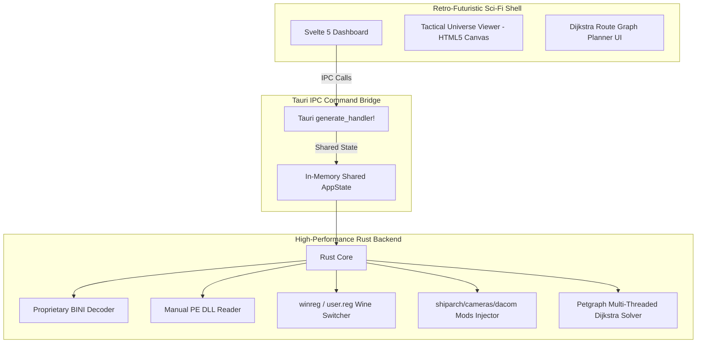

# 🌌 FL Atlas Launcher V2

[](https://github.com/flathack/FL-Atlas-Launcher/releases/latest)
[](#)
[](#)

Der **FL Atlas Launcher V2** ist ein hochperformanter Launcher der nächsten Generation für *Freelancer*, der in **Rust (Tauri v2)** und **Svelte 5** implementiert wurde. Er verbindet ein atemberaubendes, flüssiges Retro-Futuristik-Cockpit mit mächtigen Backend-Diensten zur Verwaltung multipler Spielinstallationen, Multiplayer-Identitäten (MPIDs), Spiel-Modifikationen und einer taktischen Universum-Karte mit Dijkstra-Handelsrouten-Optimierung.

---

## 🚀 Key Features

- **Multiple installations**: Manage several Freelancer installs from one launcher.
- **MPID profiles**: Save, switch, and protect multiplayer identities.
- **Safe launch flow**: Block launches before unknown registry IDs can be overwritten.
- **Game tweaks**: Apply common Freelancer fixes and quality-of-life tweaks.
- **Universe map**: View systems, bases, stations, jump gates, jump holes, fields, and routes.
- **Trade analyzer**: Find profitable trade routes and plan fast paths through the universe.
- **Auto updates**: Check GitHub Releases and update the launcher from the UI.

---

## 🌌 Anwendungsarchitektur



---

## 🛠️ Entwicklung & Installation

### Voraussetzungen
1. **Node.js**: v18+ und `npm`
2. **Rust**: Rustup und Cargo Compiler-Toolchain
3. **Tauri CLI**: `npm install -g @tauri-apps/cli` oder lokal ausführbar

### Repository einrichten & starten
```bash
# 1. Repository klonen (oder initialisieren)
git init

# 2. Node-Abhängigkeiten installieren
npm install

# 3. Entwickler-Modus starten (Frontend + Tauri-Fenster)
npm run tauri dev
```

### Production Build kompilieren
Um ein installationsbereites, optimiertes Standalone-Paket (MSI/NSIS Installer für Windows, AppImage/Deb für Linux) zu generieren:
```bash
npm run tauri build
```
Die fertigen Installationspakete und die kompilierte Binärdatei befinden sich anschließend in:
- Windows: `src-tauri/target/release/bundle/`

---

## 📝 Rechtliche Hinweise (Legal Disclaimers)

> [!IMPORTANT]
> **Markenhinweis:** "Freelancer" ist eine eingetragene Marke der **Microsoft Corporation**. Dieser Launcher steht in keinerlei Verbindung mit Microsoft Corporation, Digital Anvil oder sonstigen offiziellen Rechteinhabern. Alle Rechte an dem Spiel Freelancer verbleiben bei ihren jeweiligen Eigentümern.
>
> **Lizenz & Fan-Projekt:** Dies ist ein nicht-kommerzielles Open-Source-Fan-Projekt unter der **MIT-Lizenz**. Die Nutzung dieses Launchers erfolgt auf eigene Gefahr. Für eventuelle Datenverluste (z.B. durch manuelle Registry-Eingriffe) wird keine Haftung übernommen.

